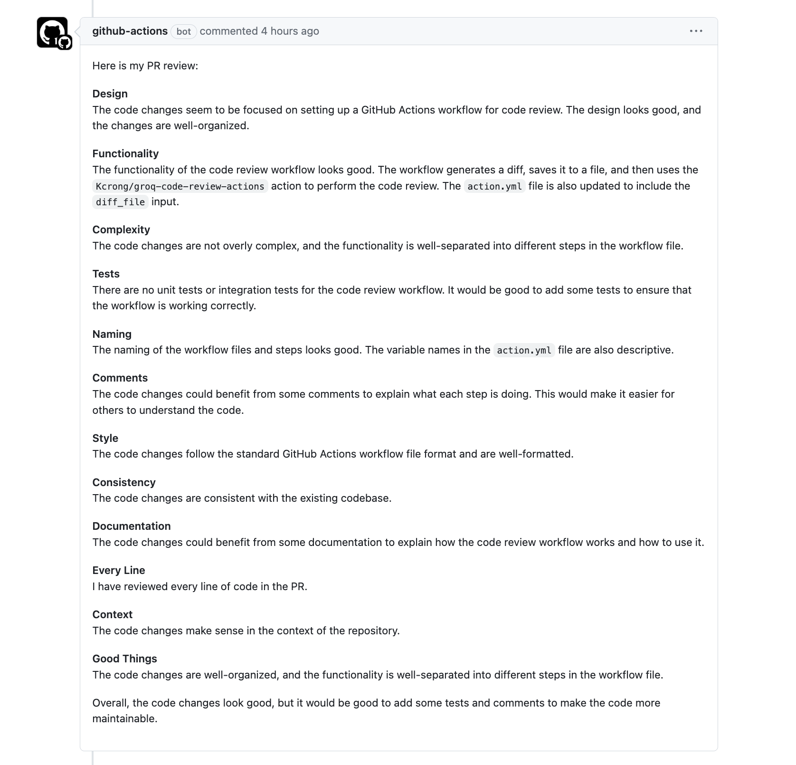

# llm-code-review-actions
GitHub Actions for code review powered by LLM using Groq

## Usage
Create action.yaml in your repository under `.github/workflows` directory with the following content:

```yaml
name: code review

on: pull_request

jobs:
  review:
    permissions:
      contents: read
      pull-requests: write

    runs-on: ubuntu-latest
    steps:
      - uses: actions/checkout@v2

      - name: Set up Go
        uses: actions/setup-go@v2

      - name: Generate diff
        uses: technote-space/get-diff-action@v6
        id: get-diff

      - name: Save diff
        if: steps.get-diff.outputs.diff
        run: |
          git fetch origin ${{ github.event.pull_request.base.ref }}
          git diff origin/${{ github.event.pull_request.base.ref }} -- . ':!vendor' ':!go.mod' ':!go.sum' > diff.txt

      - name: Review
        if: steps.get-diff.outputs.diff
        uses: magicx-ai/groq-code-review-actions@init
        with:
          groq_api_key: ${{ secrets.GROQ_API_KEY }}
          diff_file: diff.txt
```

### PR Comments
You will be able to see the comments on the PRs like this:


## Update Prompt
Refer to pkg/prompt/looking_for.go
```go
package prompt

// Ref) https://google.github.io/eng-practices/review/reviewer/looking-for.html

const CodeReviewRulePrompt = `
You are a code reviewer. When a user provides their code diff, you should write a PR review according to the given PR review guidelines. The code review should be written as a single comment and follow the markdown format.

What to look for in a code review
Note: Always make sure to take into account The Standard of Code Review when considering each of these points.

Design
The most important thing to cover in a review is the overall design of the CL. Do the interactions of various pieces of code in the CL make sense? Does this change belong in your codebase, or in a library? Does it integrate well with the rest of your system? Is now a good time to add this functionality?

Functionality
Does this CL do what the developer intended? Is what the developer intended good for the users of this code? The “users” are usually both end-users (when they are affected by the change) and developers (who will have to “use” this code in the future).

...
```
